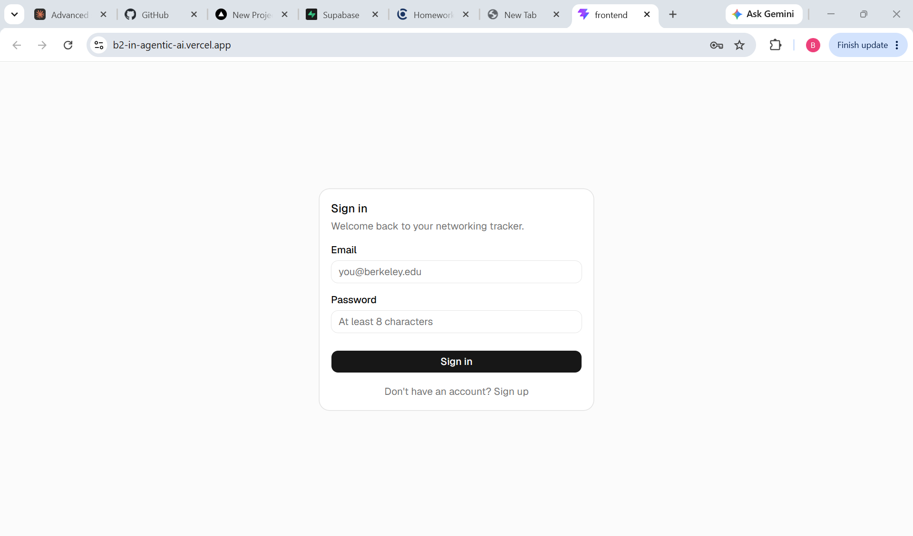
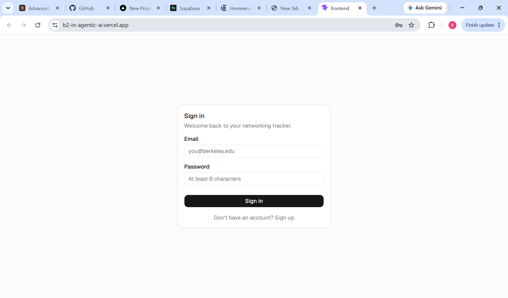
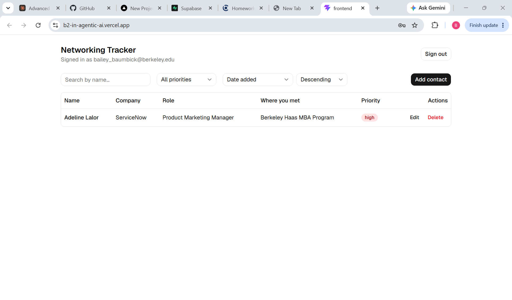
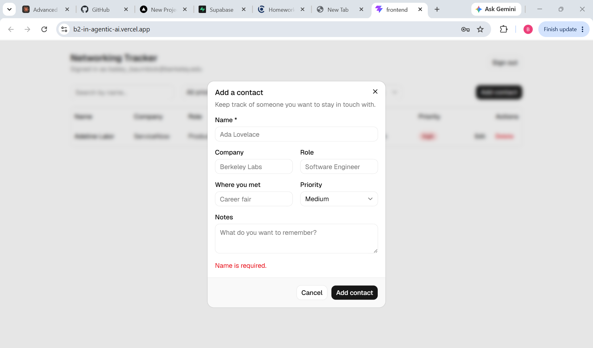

# Secure Networking Tracker

A private contact list for the people you want to stay connected with at Berkeley — add, edit, sort, and filter contacts with real per-user data isolation enforced at the database layer, not just in application code.

**Live app:** https://b2-in-agentic-ai.vercel.app

## Screenshots

See the [Evidence](#evidence) section below — it walks through sign-in/out, create/edit/delete/refresh, the two-account isolation test (with real request/response data), and an invalid-input rejection, all verified against the live URL above.

## Features

- Email/password sign-up, sign-in, and sign-out (Neon Managed Better Auth)
- Private per-user contact list — create, view, edit, delete
- Contacts have name, company, role, where you met, notes, and priority (`high` / `medium` / `low`)
- Sort by name, company, priority, date added, or last updated (ascending/descending)
- Filter by priority and search by name/company
- Loading, empty, error, and success states throughout
- Mobile-friendly: a full table on desktop, stacked cards on narrow screens
- Backend validation rejects empty names and invalid priority values with a clear message
- Row-Level Security in Postgres, independent of the application code, enforces that a user can only ever see or change their own rows

## Technology Stack

| Layer | Choice | Why |
|---|---|---|
| Frontend | React 19 + Vite, Tailwind CSS v4, shadcn/ui (Radix primitives) | A real SPA separate from the backend (no Next.js), fast dev server, and an accessible, consistent component system without hand-rolling every form control |
| Backend | Node.js + Express | A genuinely separate server that owns validation and talks to Postgres on the user's behalf — not colocated API routes in a frontend framework |
| Database | Neon Postgres | Serverless Postgres with branching, autoscaling, and native Row-Level Security |
| Auth | Neon Managed Better Auth | Hosted auth service that issues JWTs consumed directly by Postgres RLS via `auth.user_id()` — no session/JWT plumbing to build ourselves |
| Data access | Neon Data API (`@neondatabase/postgrest-js`, `@neondatabase/neon-js`) | A PostgREST-style REST layer over Postgres that enforces RLS on every request using the caller's own JWT |
| Hosting | Vercel | One deployment for both the static frontend and the Node backend, via Vercel's multi-service `vercel.json` |
| Source control | Git + GitHub | Public repo, the deliverable for this assignment |

## Architecture

```
Browser (React SPA)
  │
  ├── Auth: signUp / signIn / signOut / getSession
  │     directly against Neon's hosted Auth service
  │     (a public REST service designed to be called from the browser)
  │
  └── Contacts CRUD: fetch('/api/contacts', { Authorization: Bearer <JWT> })
        │
        ▼
      Express backend (Vercel Node service)
        1. requireAuth — checks a bearer token is present and JWT-shaped
        2. validateContact — rejects empty names / invalid priority, strips
           any client-supplied user_id
        3. forwards the SAME caller JWT to the Neon Data API
        │
        ▼
      Neon Data API (PostgREST over Postgres)
        - validates the JWT (JWKS), switches to the `authenticated` role
        - Row-Level Security policies filter every query to auth.user_id() = user_id
        │
        ▼
      Neon Postgres (contacts table, neon_auth schema)
```

**Why proxy through a backend instead of calling the Data API straight from the frontend** (which Neon's own docs explicitly allow): the assignment grades "frontend and backend separated" and "backend validation" as distinct requirements. Routing every contacts operation through Express gives a real, inspectable server doing real validation, while Postgres RLS remains the actual security boundary either way — a bug in the Express validation layer cannot leak cross-user data, because the backend never uses an elevated database connection. It only ever forwards the signed-in user's own token.

**A subtle correctness detail worth calling out:** the Data API client used to forward that token (`backend/src/lib/dataApiClient.js`) is built as a factory function, `contactsClientFor(token)`, constructed fresh inside every route handler — never a shared/module-level client with a mutable "current token" variable. Node's event loop interleaves concurrent requests from different signed-in users; a shared client would risk one user's request executing with another user's token.

## Local Setup

Prerequisites: Node.js 20+, a Neon account with a project that has Managed Better Auth and the Data API enabled.

```bash
git clone https://github.com/baileybaumbick-ops/B2InAgenticAI.git
cd B2InAgenticAI
npm run install:all
```

Create `backend/.env` and `frontend/.env` from their `.env.example` files (see [Environment Variables](#environment-variables) below), then apply the schema:

```bash
npm run db:migrate
```

Start both apps together:

```bash
npm run dev
```

- Frontend: http://localhost:5173
- Backend: http://localhost:4000 (the frontend's Vite dev server proxies `/api/*` to it)

## Environment Variables

See `.env.example` (root), `frontend/.env.example`, and `backend/.env.example`. No real values are committed anywhere in this repo or its history.

| Variable | Where | Public? | Purpose |
|---|---|---|---|
| `NEXT_PUBLIC_NEON_AUTH_URL` | frontend | Yes | Base URL of the Managed Better Auth service |
| `NEXT_PUBLIC_NEON_DATA_API_URL` | frontend | Yes | Base URL of the Neon Data API (kept for completeness against the assignment's naming; this app's frontend doesn't call it directly — see Architecture) |
| `NEON_DATA_API_URL` | backend | Yes | Same Data API URL, used server-side to build the per-request client |
| `DATABASE_URL` | backend | **No — server-only** | Postgres connection string, used **only** by `backend/scripts/migrate.js` (one-time schema/RLS setup). Never imported by the running frontend or backend server |
| `PORT` | backend | — | Local dev port for `npm run dev`. Unused on Vercel |

The Auth and Data API URLs are safe to expose publicly by design: Managed Better Auth is a hosted REST service meant to be called from the browser, and the actual security boundary is Row-Level Security in Postgres, not the secrecy of these URLs. `DATABASE_URL` is the one genuinely sensitive value, and it never appears in any code path that runs in production — only in the local migration script.

## Database Schema

`db/001_contacts_schema.sql` (idempotent, safe to re-run):

```sql
CREATE TYPE contact_priority AS ENUM ('high', 'medium', 'low');

CREATE TABLE public.contacts (
  id           uuid PRIMARY KEY DEFAULT gen_random_uuid(),
  name         text NOT NULL,
  company      text,
  role         text,
  where_met    text,
  notes        text,
  priority     contact_priority NOT NULL DEFAULT 'medium',
  user_id      text NOT NULL DEFAULT auth.user_id(),
  created_at   timestamptz NOT NULL DEFAULT now(),
  updated_at   timestamptz NOT NULL DEFAULT now(),
  CONSTRAINT contacts_name_not_blank CHECK (btrim(name) <> '')
);
```

| Column | Type | Notes |
|---|---|---|
| `id` | `uuid` | Primary key, generated |
| `name` | `text` | Required, non-blank (`CHECK` constraint + backend validation) |
| `company` | `text` | Optional |
| `role` | `text` | Optional |
| `where_met` | `text` | Optional |
| `notes` | `text` | Optional |
| `priority` | `contact_priority` enum | `high` / `medium` / `low` only — invalid values are rejected by Postgres itself, independent of the backend |
| `user_id` | `text` | Defaults to `auth.user_id()` (the caller's JWT `sub` claim); **not null**; drives every RLS policy |
| `created_at`, `updated_at` | `timestamptz` | `updated_at` auto-refreshes via a trigger on every `UPDATE` |

## Authentication & Row-Level Security

Managed Better Auth issues a JWT on sign-in whose `sub` claim is the user's id. Every request to the Data API carries that JWT; the Data API validates it and exposes `auth.user_id()` as a SQL function returning that `sub` claim. RLS policies use it directly:

```sql
ALTER TABLE public.contacts ENABLE ROW LEVEL SECURITY;

CREATE POLICY contacts_select_own ON public.contacts
  FOR SELECT TO authenticated
  USING (auth.user_id() = user_id);

CREATE POLICY contacts_insert_own ON public.contacts
  FOR INSERT TO authenticated
  WITH CHECK (auth.user_id() = user_id);

CREATE POLICY contacts_update_own ON public.contacts
  FOR UPDATE TO authenticated
  USING (auth.user_id() = user_id)
  WITH CHECK (auth.user_id() = user_id);  -- blocks reassigning a row to another user

CREATE POLICY contacts_delete_own ON public.contacts
  FOR DELETE TO authenticated
  USING (auth.user_id() = user_id);
```

Four separate policies, one per operation, all keyed on the same ownership check. `USING` controls which existing rows are visible/targetable; `WITH CHECK` controls what a write is allowed to leave behind — so `UPDATE` can't be used to reassign a contact to someone else's `user_id`, and `INSERT` can't create a row owned by anyone but the caller. RLS applies **before** the application ever sees the data: even if the Express backend had a validation bug, a cross-user read or write is rejected by Postgres itself.

## Testing

```bash
cd backend
npm test
```

This runs a Vitest suite (`backend/test/contacts.validation.test.js`) against the `validateContact` middleware in isolation — no network or database calls, so it's fast and deterministic. It verifies:

- an empty/whitespace-only name is rejected with a clear error message
- a priority outside `high` / `medium` / `low` is rejected with a clear error message
- a valid payload passes through to the next handler
- a client-supplied `user_id` is stripped (ownership is never client-controlled)
- name is required on create but optional (and still validated) on edit

**Output:**

```
 RUN  v5.0.0

 Test Files  1 passed (1)
      Tests  7 passed (7)
```

The database/RLS boundary itself is verified separately, end-to-end, against the live app (see [Evidence](#evidence)) rather than mocked in this unit suite — that keeps the automated test fast while the security-critical path is checked against the real thing.

## Deployment

The app is hosted on Vercel as two services declared in the root `vercel.json`: the Vite frontend (static build) and the Express backend (Node service), with `/api/*` routed to the backend and everything else to the frontend.

1. Push to GitHub.
2. Import the repo on [vercel.com/new](https://vercel.com/new) — Vercel reads `vercel.json` and detects both services automatically (a React/Vite "frontend" service and a Node "backend" service, per `vercel.json`'s `services` block).
3. `vercel.json`'s `env` block supplies `NEON_DATA_API_URL` to the backend service at runtime (Vercel docs: `env` in `vercel.json` applies to functions, which is what a Node service runs as under the hood). It does **not** reach the frontend's static build step, though — Vite bakes `import.meta.env.*` values in at build time, and that build runs before any function-scoped env is available. So `NEXT_PUBLIC_NEON_AUTH_URL` and `NEXT_PUBLIC_NEON_DATA_API_URL` must be set as real Project → Environment Variables in the Vercel dashboard (Production **and** Preview) before the first deploy, or the frontend silently falls back to a relative auth URL and sign-in breaks.
4. Add the deployed domain as a trusted domain in Neon Auth (via the Neon Console or the `add_auth_trusted_domain` API) so sign-in works on the live URL, not just `localhost`.
5. Re-run the full verification checklist — including the two-account isolation test — against the production URL.

## Known Limitations & Next Steps

- No email verification or password reset flow (Managed Better Auth supports both; out of scope for this assignment).
- No pagination — fine at demo scale, would need `.limit()`/cursor-based paging for a large contact list.
- `@neondatabase/postgrest-js` ships ESM-only; it's `require()`'d dynamically via a cached `import()` (see `backend/src/lib/dataApiClient.js`) so it works under Vercel's Node runtime as well as older/newer local Node versions. Worth knowing if this dependency is ever swapped or upgraded.
- No automated integration test against a live Data API/RLS (the unit suite covers backend validation; the RLS boundary is verified manually per the Evidence section). A follow-up could spin up a disposable Neon branch in CI and run a real two-account isolation test automatically.

## Evidence

Everything below was verified directly against the **live production URL**, not just locally.

### Automated test output

See [Testing](#testing) above — 7/7 passing.

### Sign-in / sign-out

Signing in lands on the dashboard with the contacts table; signing out returns cleanly to the sign-in screen.




### Create, edit, delete, and refresh a contact

A contact ("Adeline Lalor," ServiceNow) created through the "Add contact" form, shown here after a full browser refresh — proof it's persisted in Neon Postgres, not local/session state.



### Two-account isolation (User A cannot access User B's contacts)

Two real Managed Better Auth accounts (`test-a@example.com`, `test-b@example.com`) were created and run against the live production API:

```
=== A creates a contact ===
POST /api/contacts  (as A)
→ 201 {"id":"fab93325-...","name":"Alice Aardvark","company":"Acme","priority":"high", ...}

=== B lists contacts ===
GET /api/contacts  (as B)
→ 200 []                                    # B cannot see A's contact at all

=== B tries to update A's contact by id ===
PUT /api/contacts/fab93325-...  (as B)
→ 404 {"error":"Contact not found."}         # RLS filters the row before B's update can match it

=== B tries to delete A's contact by id ===
DELETE /api/contacts/fab93325-...  (as B)
→ 404 {"error":"Contact not found."}

=== A confirms her contact is untouched ===
GET /api/contacts  (as A)
→ 200 [{"id":"fab93325-...","name":"Alice Aardvark", ...}]   # unchanged
```

B's requests aren't rejected because of an `if` statement in Express — the backend forwards B's own JWT to the Data API exactly like it would for any request, and Postgres Row-Level Security silently filters out rows B doesn't own, so B's `UPDATE`/`DELETE` match zero rows. The backend turns "zero rows matched" into a 404 rather than a misleading success.

### Invalid input fails safely

Submitting the "Add contact" form with an empty name shows "Name is required." inline, without submitting:



The backend independently rejects the same cases, so a request that bypassed the frontend entirely would still fail safely:

```
POST /api/contacts  {"name": "   "}
→ 400 {"error":"Name is required and cannot be empty."}

POST /api/contacts  {"name": "X", "priority": "urgent"}
→ 400 {"error":"Priority must be one of: high, medium, low."}
```
